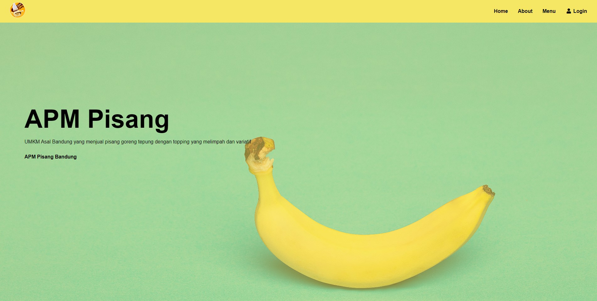
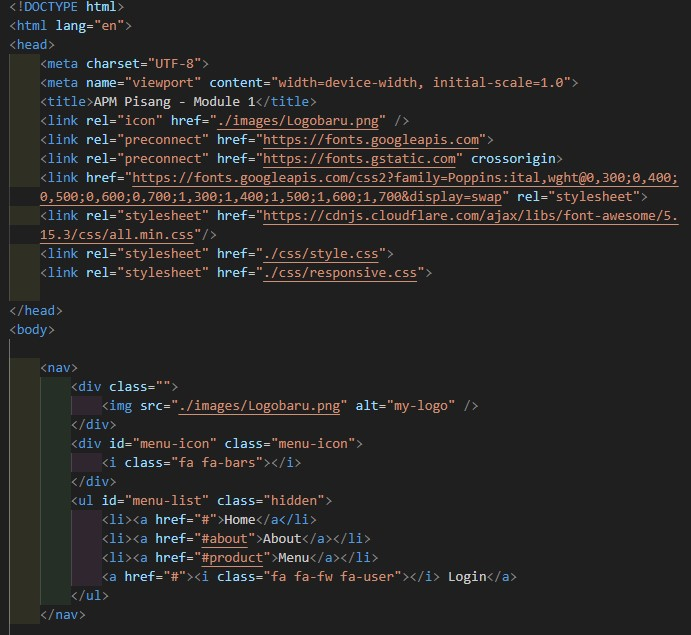
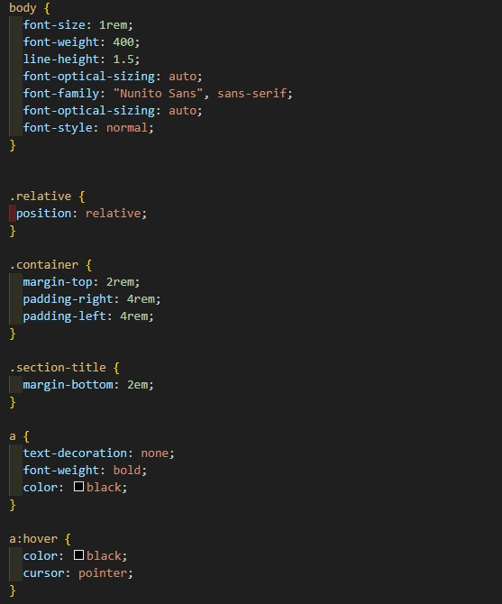
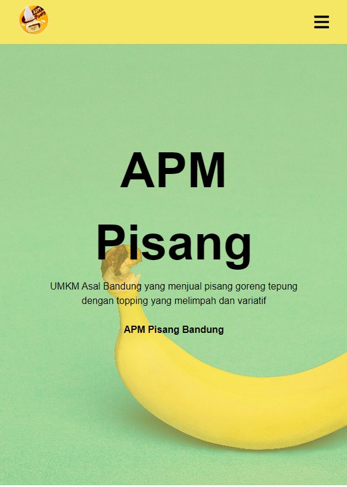

# Module 1 Ridzky Sulthan 

Selamat datang di website APM Pisang yang berisi tentang UMKM dari Bandung yang menjual produk olahan pisang menjadi cemilan.

## 🍌 Software & Tools 
| Software & Tools                                                                                                    |
|---------------------------------------------------------------------------------------------------------------------|
|            |
| 
               |

## 🍌 Website APM Pisang

## 🍌 Building Process

1. Making the structure of the html and also add the content.

2. Add css styling, fonts, etc that I want to use.

3. Add responsiveness for a different layout devices using media query.

## 🍌 Link 

[Menuju Website](https://apmpisangofficial.netlify.app)